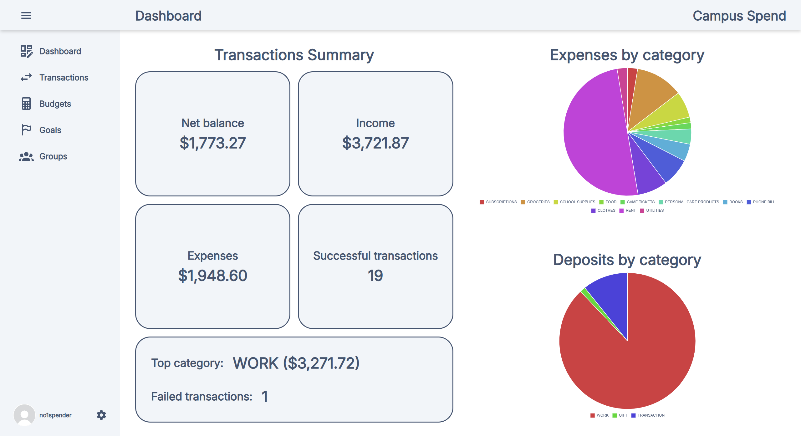
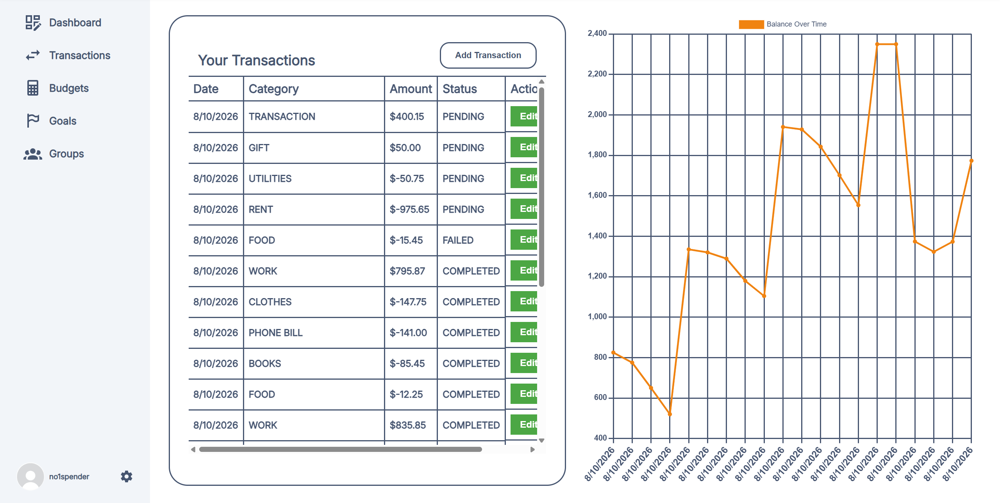
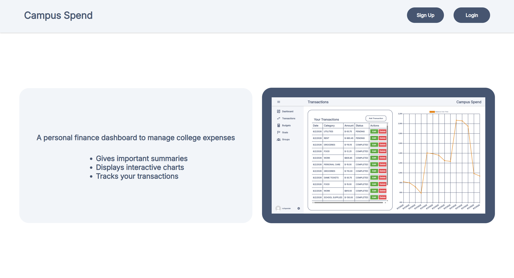
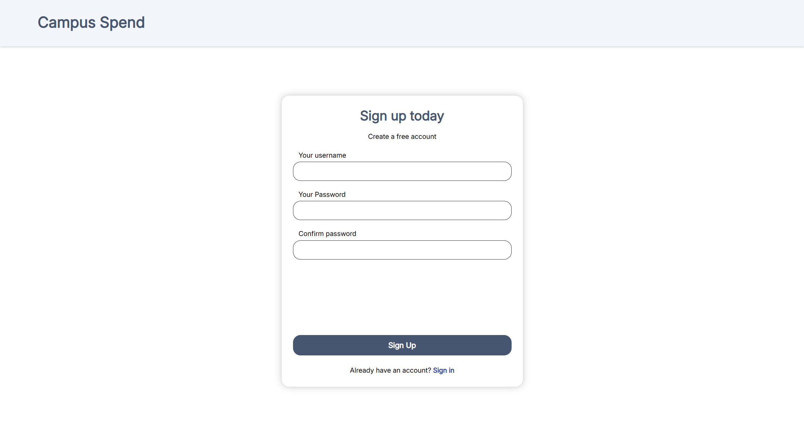
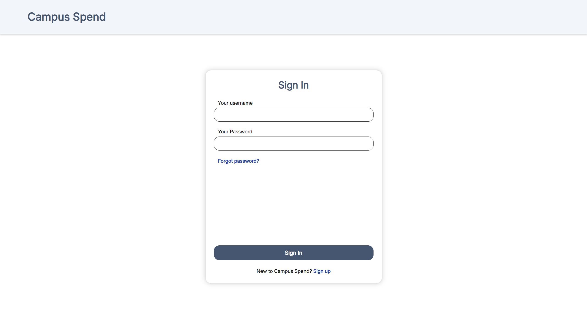
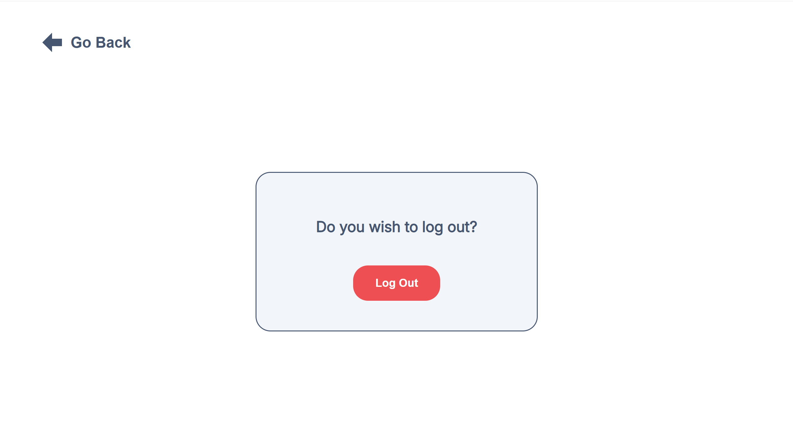

# Campus Spend Finance Dashboard

A personal finance application built with a React frontend, Spring Boot REST API, and a PostgreSQL database.

Live demo: https://finance-dashboard-phi-blond.vercel.app/

This project was made with the intention of learning full-stack architecture, modern software development tools, and deploying real apps to cloud hosting platforms.

---

## Screenshots

### Dashboard

### Transactions

### Home

### Register

### Login

### Logout

---

## Architecture

The application's frontend, backend, and database are deployed independently.

- The frontend is built with Vite and deployed on Vercel. 
- The backend is a Dockerized Java Spring Boot application running as a Render Web Service.
- The database is a PostgreSQL instance on Render.

---

## Tech Stack

**Frontend**
- React
- Vite
- CSS3
- Vercel deployment

**Backend**
- Java 25
- Spring Boot
- Spring Security (JWT auth, BCrypt password hashing)
- Spring Data JPA
- Flyway DB migrations
- Maven
- Render deployment user Docker

**Database**
- PostgreSQL database
- Hosted on Render

---

## Features
- Homepage with registration and login navigation
- Registration and login pages with JWT-based authentication and input validation
- Protected API routes requiring auth bearer token
- Retractable sidebar with links to navigate to transactions, budgets, goals, or groups page
- Main dashboard page with transaction summaries and charts
- Transaction page with ability to create, update, or delete transactions
- Table that displays history of all transactions
- Chart that displays account balance over time
- Settings page that allows a user to log out

---

## Limitations
- Since the backend is using a free Render web service, the backend will spin down after periods of inactivity, so requests may take a while to respond.

---

## Credits
- SVGs: https://pictogrammers.com/library/mdi/
- Default pfp: https://www.pinterest.com/pin/213428469837729307/
- Font: https://fonts.google.com/specimen/Inter
